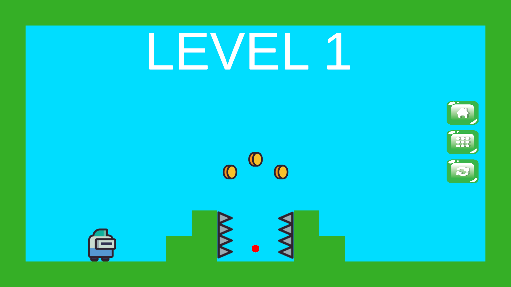
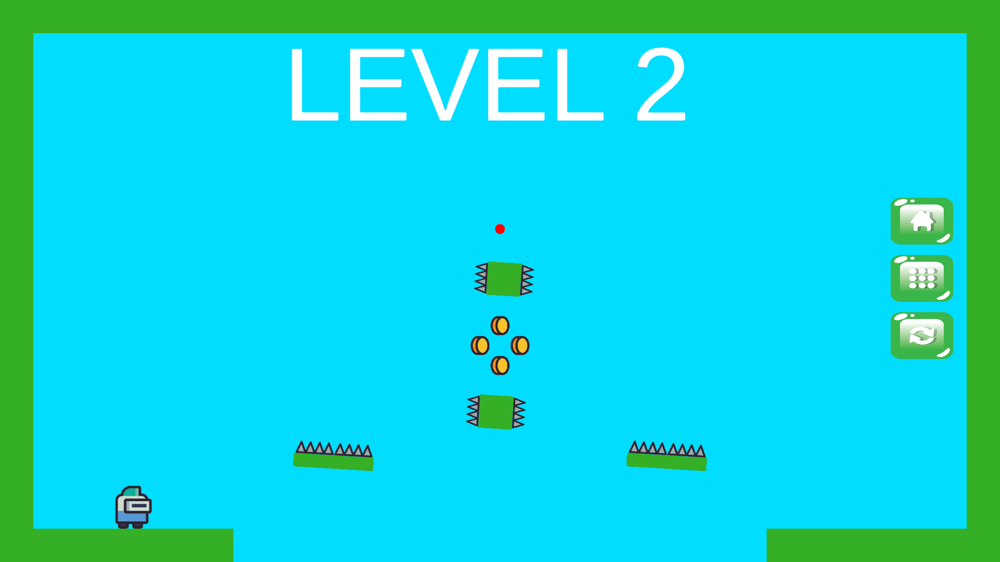
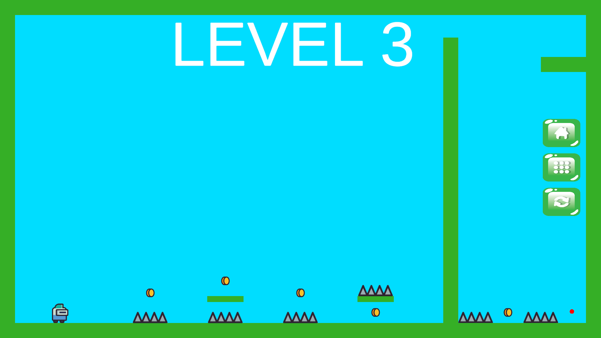
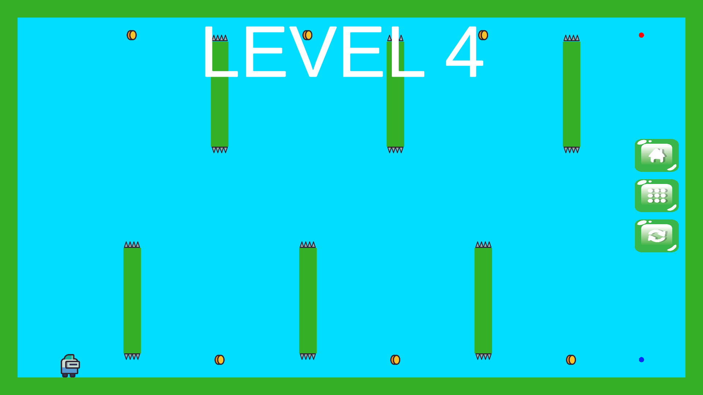
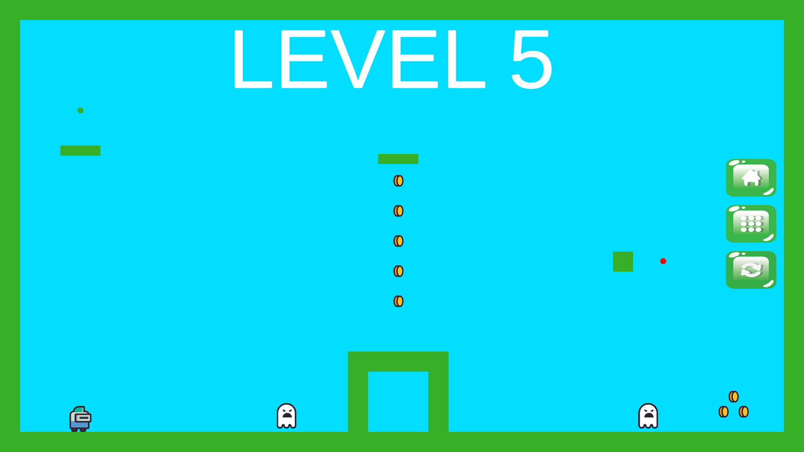
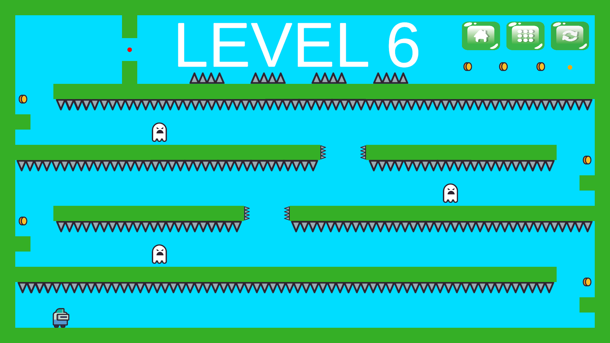

<h1 align="center">Easy Platform</h1>

<p align="center">
A 2D level-based platformer game developed with Unity and C#.<br>
Run, jump, collect coins, activate flags, avoid hazards, and complete six progressively harder levels.
</p>

<p align="center">
  
  
  
  
  
  
  
  
</p>

---

## Project Overview

**Easy Platform** is a 2D platformer game where the player progresses through six handcrafted levels by reaching the flag at the end of each stage.

Each level is built around a simple platformer loop:

- move through the level,
- jump across platforms and gaps,
- collect coins,
- avoid enemies and spikes,
- activate the flag by collecting the required key object,
- reach the flag to unlock the next level.

The game also includes a level selection menu with sequential unlocking. Later levels introduce special mechanics such as gravity reversal, obstacle removal, ghost-like hazards, and spike-clearing pickups.

| Level 1 | Level 2 |
|---|---|
|  |  |
| Level 3 | Level 4 |
|  |  |
| Level 5 | Level 6 |
|  |  |

---

## Supported Platform

Easy Platform is currently organized as a **PC Unity project**.

- Keyboard input is used for gameplay.
- The project can be opened directly from the repository root in Unity Hub.
- Compiled builds are not stored in the source repository.

---

## Project Structure

```text
Easy_Platform/
|-- Assets/
|   |-- 2D Platformer/
|   |-- animations/
|   |-- JellyIcons/
|   |-- musics/
|   |-- Scenes/
|   |   |-- menu.unity
|   |   |-- levels.unity
|   |   |-- lvl1.unity
|   |   |-- lvl2.unity
|   |   |-- lvl3.unity
|   |   |-- lvl4.unity
|   |   |-- lvl5.unity
|   |   `-- lvl6.unity
|   |-- screenshots/
|   |   |-- level-1.png
|   |   |-- level-2.png
|   |   |-- level-3.png
|   |   |-- level-4.png
|   |   |-- level-5.png
|   |   `-- level-6.png
|   |-- scripts/
|   |   |-- mainscript.cs
|   |   |-- lvlsscript.cs
|   |   `-- animationscript.cs
|   `-- TextMesh Pro/
|-- Packages/
|   |-- manifest.json
|   `-- packages-lock.json
|-- ProjectSettings/
|-- LICENSE
|-- README.md
`-- .gitignore
```

Unity-generated folders such as `Library`, `Logs`, `UserSettings`, and `obj` are intentionally ignored by Git.

---

## Core Systems

### Player Movement

- Horizontal movement with arrow keys or `A` / `D`.
- Jump input with `Space`, `W`, or `Up Arrow`.
- Ground detection prevents repeated mid-air jumping.
- The player sprite turns based on movement direction.

### Level Progression

- The game contains six playable levels.
- Completing a level unlocks the next level.
- The level selection scene keeps locked levels unavailable until the previous level is completed.
- After finishing the sixth level, the player returns to the level menu.

### Flag Activation

- Each level requires the player to collect a key-like object before the flag becomes active.
- Once the flag is activated, reaching it completes the level.
- A flag sound effect confirms successful activation or level completion.

### Hazards and Failure

- Enemy and hazard collisions trigger the death flow.
- After death, the current scene reloads automatically.
- Spikes, enemies, moving obstacles, gaps, and level-specific hazards create platforming pressure.

### Special Level Mechanics

- **Level 4 - Blue Sphere:** reverses gravity and lets the player complete an upside-down route.
- **Level 5 - Green Sphere:** removes a blocking obstacle after the player avoids ghost-like hazards.
- **Level 6 - Yellow Sphere:** removes all spike barriers, making the final route easier to complete.

---

## Features

### Six-Level Platformer Campaign

- Handcrafted level progression from basic platforming to special mechanics.
- Sequential unlock system for level selection.
- Clear objective structure built around keys, flags, and hazards.

### Classic 2D Controls

- Keyboard-based movement and jumping.
- Fast retry loop after failure.
- Simple input scheme suitable for arcade-style platforming.

### Animated Gameplay Elements

- Player idle, run, and jump animation triggers.
- Animated enemies and obstacles.
- Rotating objects and moving hazards add visual motion to each level.

### Menu and Level Selection

- Main menu with play, level selection, and quit actions.
- Dedicated level selection screen.
- Locked level buttons become available as the player progresses.

### Audio Feedback

- Jump sound effect.
- Coin collection sound effect.
- Death sound effect.
- Flag and key interaction sound effect.
- Background music included in the Unity project.

---

## Game Mechanics

### Movement

The player moves horizontally using keyboard input. Movement directly updates the player's `Rigidbody2D` velocity and flips the character based on direction.

### Jumping

Jumping is available only when the player is grounded. A successful jump applies upward velocity and plays the jump sound effect.

### Gravity Reversal

In Level 4, collecting the blue sphere reverses the player's gravity scale. Controls continue to work while the player completes the level from an inverted orientation.

### Obstacle Removal

Some levels include collectible objects that remove barriers or hazards. The green sphere clears a blocking object, while the yellow sphere disables a group of spike barriers.

### Level Unlocking

The level selection screen uses shared level state to enable buttons for newly unlocked levels. Each completed flag interaction unlocks the next level in sequence.

---

## How to Play

1. Start the game from the main menu.
2. Move through the level and avoid hazards.
3. Collect coins when possible.
4. Find the key object that activates the flag.
5. Reach the active flag to complete the level.
6. Continue through all six levels.

---

## Controls

| Action | Control |
|---|---|
| Move Left | `Left Arrow` or `A` |
| Move Right | `Right Arrow` or `D` |
| Jump | `Space`, `W`, or `Up Arrow` |
| Menu Buttons | Mouse click |

---

## Technologies Used

- **Unity Engine 2022.3.7f1** - game development engine.
- **C#** - gameplay, level progression, UI, and scene logic.
- **TextMeshPro** - text rendering inside the Unity project.
- **Unity UI (UGUI)** - menu and level selection buttons.
- **Unity 2D Physics** - Rigidbody2D movement and collision-based gameplay.
- **Unity Animator** - player, enemy, and obstacle animations.

---

## Assets and Audio

### Visual Assets

- 2D Platformer:

https://assetstore.unity.com/packages/tools/game-toolkits/2d-platformer-229878

- Jelly Icons:

https://assetstore.unity.com/packages/2d/gui/icons/jelly-icons-99749

### Audio Assets

- RPG Essentials Sound Effects - FREE:

https://assetstore.unity.com/packages/audio/sound-fx/rpg-essentials-sound-effects-free-227708

- Fantasy Tavern Music Free Pack:

https://assetstore.unity.com/packages/audio/music/fantasy-tavern-music-free-pack-118847

---

## Installation and Play

1. Clone the repository:

```bash
git clone https://github.com/AFurkanOcel/Easy_Platform.git
```

2. Open the project folder with Unity Hub:

```text
Easy_Platform
```

3. Use **Unity 2022.3.7f1** or a compatible Unity 2022.3 LTS version.

4. Open the main menu scene:

```text
Assets/Scenes/menu.unity
```

5. Press **Play** in the Unity Editor.

### Builds

Compiled builds are not stored in this source repository. Release builds should be distributed through GitHub Releases, itch.io, or another download page.

---

## Credits

### Game Development

**A. Furkan ÖCEL**

GitHub: https://github.com/AFurkanOcel

---

## License

This project is licensed under the terms included in the repository's `LICENSE` file.
